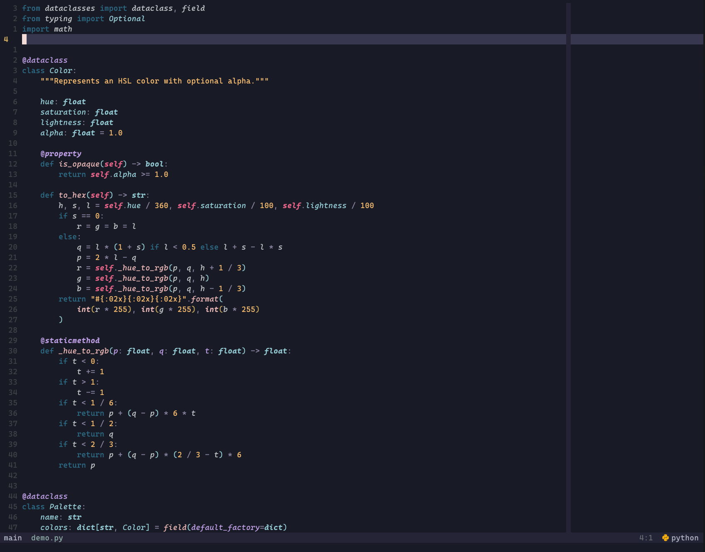
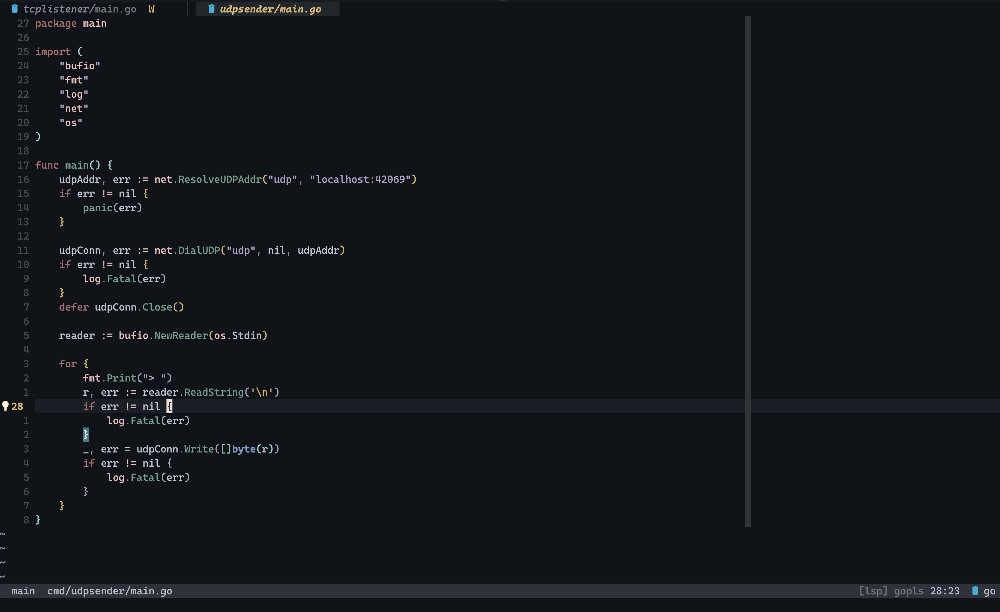

# homesick.nvim

Homesick is a Neovim colorscheme with three built-in variants:

### Moon
*Inspired by [Rosé Pine](https://github.com/rose-pine/neovim) with a darker, cooler base.*



### Night


### Galaxy
*Night UI surfaces with Moon syntax colors.*


## Install (lazy.nvim)

```lua
{
  "amiraminb/homesick.nvim",
  lazy = false,
  priority = 1000,
  config = function()
    vim.cmd.colorscheme("homesick")
  end,
}
```

## Variants

Use any of these:

- `:colorscheme homesick` (defaults to night)
- `:colorscheme homesick-moon`
- `:colorscheme homesick-night`
- `:colorscheme homesick-galaxy`

Or from Lua:

```lua
require("homesick").setup({ variant = "night" })
require("homesick").load()
```

`night` is the plugin default when no variant is specified.

You can also set:

```lua
vim.g.homesick_variant = "night"
```

before loading the colorscheme.

## Integrations

### Bufferline

Homesick provides a dedicated bufferline highlight map.

```lua
local variant = vim.g.homesick_variant or "moon"

require("bufferline").setup({
  highlights = require("homesick.plugins.bufferline").get(variant),
})
```

### nvim-cmp

Homesick also provides a dedicated `nvim-cmp` highlight map.

```lua
local variant = vim.g.homesick_variant or "moon"

for group, spec in pairs(require("homesick.plugins.cmp").get(variant)) do
  vim.api.nvim_set_hl(0, group, spec)
end
```

### vim-illuminate

Homesick provides an explicit illuminate integration map.

```lua
local variant = vim.g.homesick_variant or "moon"

for group, spec in pairs(require("homesick.plugins.illuminate").get(variant)) do
  vim.api.nvim_set_hl(0, group, spec)
end
```

### blink.cmp

Homesick provides a dedicated `blink.cmp` highlight map.

```lua
local variant = vim.g.homesick_variant or "moon"

for group, spec in pairs(require("homesick.plugins.blink").get(variant)) do
  vim.api.nvim_set_hl(0, group, spec)
end
```

### lualine

Homesick provides a dedicated `lualine` theme table.

```lua
local variant = vim.g.homesick_variant or "moon"

require("lualine").setup({
  options = {
    theme = require("homesick.plugins.lualine").get(variant),
  },
})
```

### telescope

Homesick provides a dedicated `telescope.nvim` highlight map.

```lua
local variant = vim.g.homesick_variant or "moon"

for group, spec in pairs(require("homesick.plugins.telescope").get(variant)) do
  vim.api.nvim_set_hl(0, group, spec)
end
```

### nvim-tree

Homesick provides a dedicated `nvim-tree` highlight map.

```lua
local variant = vim.g.homesick_variant or "moon"

for group, spec in pairs(require("homesick.plugins.nvimtree").get(variant)) do
  vim.api.nvim_set_hl(0, group, spec)
end
```

### trouble.nvim

Homesick provides a dedicated `trouble.nvim` highlight map.

```lua
local variant = vim.g.homesick_variant or "moon"

for group, spec in pairs(require("homesick.plugins.trouble").get(variant)) do
  vim.api.nvim_set_hl(0, group, spec)
end
```

### gitsigns.nvim

Homesick provides a dedicated `gitsigns.nvim` highlight map.

```lua
local variant = vim.g.homesick_variant or "moon"

for group, spec in pairs(require("homesick.plugins.gitsigns").get(variant)) do
  vim.api.nvim_set_hl(0, group, spec)
end
```

### snacks.nvim

Homesick provides a dedicated `snacks.nvim` highlight map.

```lua
local variant = vim.g.homesick_variant or "moon"

for group, spec in pairs(require("homesick.plugins.snacks").get(variant)) do
  vim.api.nvim_set_hl(0, group, spec)
end
```

### diffview.nvim

Homesick provides a dedicated `diffview.nvim` highlight map.

```lua
local variant = vim.g.homesick_variant or "moon"

for group, spec in pairs(require("homesick.plugins.diffview").get(variant)) do
  vim.api.nvim_set_hl(0, group, spec)
end
```

### render-markdown.nvim

Homesick provides a dedicated `render-markdown.nvim` highlight map.

```lua
local variant = vim.g.homesick_variant or "moon"

for group, spec in pairs(require("homesick.plugins.render_markdown").get(variant)) do
  vim.api.nvim_set_hl(0, group, spec)
end
```

### todo-comments.nvim

```lua
for group, spec in pairs(require("homesick.plugins.todo_comments").get(vim.g.homesick_variant or "moon")) do
  vim.api.nvim_set_hl(0, group, spec)
end
```

### flash.nvim

```lua
for group, spec in pairs(require("homesick.plugins.flash").get(vim.g.homesick_variant or "moon")) do
  vim.api.nvim_set_hl(0, group, spec)
end
```

### git-conflict.nvim

```lua
for group, spec in pairs(require("homesick.plugins.git_conflict").get(vim.g.homesick_variant or "moon")) do
  vim.api.nvim_set_hl(0, group, spec)
end
```

### fidget.nvim

```lua
for group, spec in pairs(require("homesick.plugins.fidget").get(vim.g.homesick_variant or "moon")) do
  vim.api.nvim_set_hl(0, group, spec)
end
```

### toggleterm.nvim

```lua
for group, spec in pairs(require("homesick.plugins.toggleterm").get(vim.g.homesick_variant or "moon")) do
  vim.api.nvim_set_hl(0, group, spec)
end
```

### lspsaga.nvim

```lua
for group, spec in pairs(require("homesick.plugins.lspsaga").get(vim.g.homesick_variant or "moon")) do
  vim.api.nvim_set_hl(0, group, spec)
end
```

### nvim-dap

```lua
for group, spec in pairs(require("homesick.plugins.dap").get(vim.g.homesick_variant or "moon")) do
  vim.api.nvim_set_hl(0, group, spec)
end
```

### rainbow-delimiters.nvim

```lua
for group, spec in pairs(require("homesick.plugins.rainbow_delimiters").get(vim.g.homesick_variant or "moon")) do
  vim.api.nvim_set_hl(0, group, spec)
end
```

### zen-mode.nvim

```lua
for group, spec in pairs(require("homesick.plugins.zenmode").get(vim.g.homesick_variant or "moon")) do
  vim.api.nvim_set_hl(0, group, spec)
end
```

### winshift.nvim

```lua
for group, spec in pairs(require("homesick.plugins.winshift").get(vim.g.homesick_variant or "moon")) do
  vim.api.nvim_set_hl(0, group, spec)
end
```

### Auto-apply helper

If you want Homesick integration highlights to be applied automatically after each colorscheme load:

```lua
require("homesick.integrations").setup({
  cmp = true,
  blink = true,
  illuminate = true,
  telescope = true,
  nvimtree = true,
  trouble = true,
  gitsigns = true,
  snacks = true,
  diffview = true,
  render_markdown = true,
  todo_comments = true,
  flash = true,
  git_conflict = true,
  fidget = true,
  toggleterm = true,
  lspsaga = true,
  dap = true,
  rainbow_delimiters = true,
  zenmode = true,
  winshift = true,
})
```

Disable any integration by setting it to `false`.
