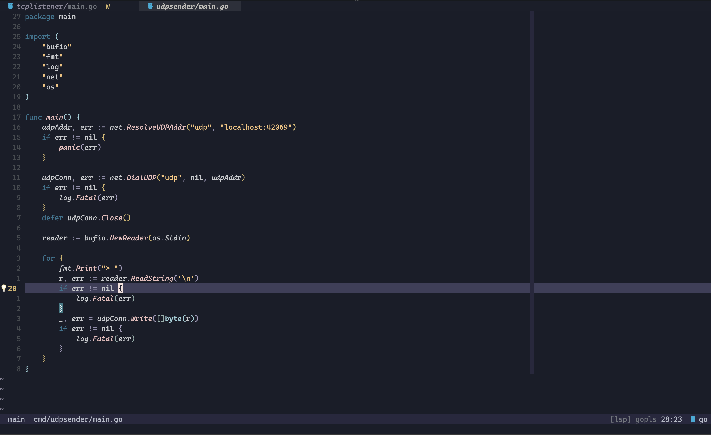
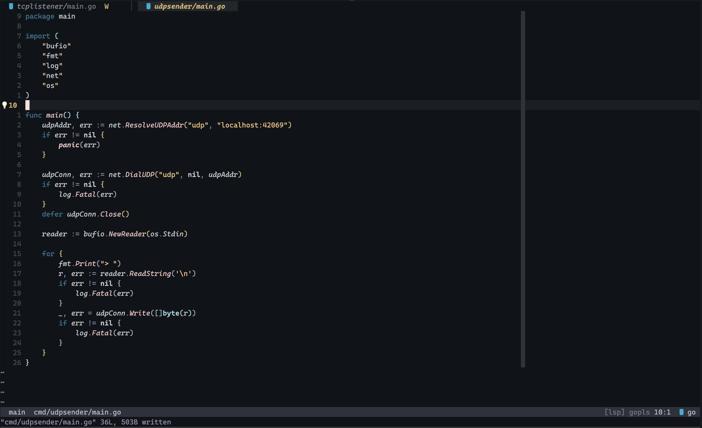

# homesick.nvim

Homesick is a Neovim colorscheme with three built-in variants:

### Moon
*Inspired by [Rosé Pine](https://github.com/rose-pine/neovim) with a darker, cooler base.*



### Night


### Galaxy
*Night UI surfaces with Moon syntax colors.*



## Install (lazy.nvim)

```lua
{
  "amiraminb/homesick.nvim",
  lazy = false,
  priority = 1000,
  config = function()
    vim.cmd.colorscheme("homesick")
  end,
}
```

## Variants

Use any of these:

- `:colorscheme homesick` (defaults to night)
- `:colorscheme homesick-moon`
- `:colorscheme homesick-night`
- `:colorscheme homesick-galaxy`

Or from Lua:

```lua
require("homesick").setup({ variant = "night" })
require("homesick").load()
```

`night` is the plugin default when no variant is specified.

You can also set:

```lua
vim.g.homesick_variant = "night"
```

before loading the colorscheme.

## Integrations

Homesick ships plugin integration modules under `homesick.plugins.*`.

### Recommended (auto-apply)

Apply all integration highlights automatically after colorscheme load:

```lua
require("homesick.integrations").setup({
  cmp = true,
  blink = true,
  illuminate = true,
  telescope = true,
  nvimtree = true,
  trouble = true,
  gitsigns = true,
  snacks = true,
  diffview = true,
  render_markdown = true,
  todo_comments = true,
  flash = true,
  git_conflict = true,
  fidget = true,
  toggleterm = true,
  lspsaga = true,
  dap = true,
  rainbow_delimiters = true,
  zenmode = true,
  winshift = true,
})
```

Disable any integration by setting it to `false`.

### Special setup

`bufferline.nvim`:

```lua
local variant = vim.g.homesick_variant or "moon"

require("bufferline").setup({
  highlights = require("homesick.plugins.bufferline").get(variant),
})
```

`lualine.nvim`:

```lua
local variant = vim.g.homesick_variant or "moon"

require("lualine").setup({
  options = {
    theme = require("homesick.plugins.lualine").get(variant),
  },
})
```

### Available integrations

- `bufferline`
- `cmp`
- `blink`
- `illuminate`
- `telescope`
- `nvimtree`
- `trouble`
- `gitsigns`
- `snacks`
- `diffview`
- `render_markdown`
- `todo_comments`
- `flash`
- `git_conflict`
- `fidget`
- `toggleterm`
- `lspsaga`
- `dap`
- `rainbow_delimiters`
- `zenmode`
- `winshift`
